# MessageAI Architecture Diagram

```mermaid
graph TB
    %% Client Layer - Mobile Apps
    subgraph "Mobile Apps"
        iOS["iOS App<br/>(TestFlight - Primary)"]
        PWA["PWA Web App<br/>(Safari/Chrome - Secondary)"]
    end

    %% Client Layer - Quasar App
    subgraph "Quasar Vue 3 App"
        subgraph "Pages"
            AuthPage["Auth Pages<br/>(Login/Signup)"]
            ChatList["Chat List<br/>(QList/QItem)"]
            ChatView["Chat View<br/>(QChatMessage)"]
            AIAssistant["AI Assistant<br/>(QChatMessage)"]
            SearchPage["Search Page<br/>(Semantic Search)"]
        end

        subgraph "Composables"
            UseChat["useChat()<br/>(Messages, Send, Realtime)"]
            UseAIChat["useAIChat()<br/>(Streaming, Tools)"]
        end

        subgraph "Reactive State"
            AuthState["Auth State<br/>(user, isAuthenticated)"]
            ChatState["Chat State<br/>(messages, typing)"]
        end

        subgraph "Capacitor Plugins"
            Camera["Camera<br/>(Image Capture)"]
            Push["Push Notifications<br/>(FCM Tokens)"]
            Network["Network<br/>(Online/Offline)"]
            App["App Lifecycle<br/>(Background/Foreground)"]
            Storage["Local Storage<br/>(Offline Queue)"]
        end
    end

    %% Backend Layer - Supabase
    subgraph "Supabase Backend"
        subgraph "Database (PostgreSQL)"
            Profiles["profiles<br/>(user data, avatars)"]
            Chats["chats<br/>(1:1 & groups)"]
            Messages["messages<br/>(text, media, status)"]
            Groups["groups & group_members<br/>(multi-user chats)"]
            Tasks["tasks<br/>(action items)"]
            Decisions["decisions<br/>(tracking status)"]
            Embeddings["embeddings<br/>(pgvector RAG)"]
        end

        subgraph "Realtime"
            RealtimeChannels["Realtime Channels<br/>(message updates)"]
            Presence["Presence System<br/>(online/offline)"]
        end

        subgraph "Edge Functions"
            AIExecute["/ai/execute<br/>(LLM Processing)"]
            AISearch["/ai/search<br/>(Semantic Search)"]
            AIProactive["/ai/proactive<br/>(Conflict Detection)"]
            PushSend["/push/send<br/>(FCM Notifications)"]
        end

        subgraph "Storage"
            MediaBucket["Media Bucket<br/>(Images, Files)"]
        end

        Auth["Supabase Auth<br/>(Email/Password)"]
    end

    %% AI Layer
    subgraph "AI Services"
        VercelSDK["Vercel AI SDK<br/>(Vue Integration)"]
        OpenAI["OpenAI GPT-4o-mini<br/>(LLM Processing)"]
        RAG["RAG System<br/>(Context Retrieval)"]
        Tools["Tool Calling<br/>(Action Extraction)"]
    end

    %% Testing Layer
    subgraph "Testing Infrastructure"
        E2ETests["E2E Tests<br/>(Playwright)"]
        UnitTests["Unit Tests<br/>(Vitest)"]
        PrePushHooks["Pre-push Hooks<br/>(Husky)"]
        TestTracking["Test Tracking<br/>(tests.md)"]
        IOSTests["iOS Simulator Tests<br/>(Playwright webkit)"]
    end

    %% External Services
    subgraph "External Services"
        FCM["Firebase Cloud Messaging<br/>(Push Notifications)"]
        APNs["Apple Push Notification Service<br/>(iOS)"]
    end

    %% Data Flow Connections
    iOS --> AuthPage
    PWA --> AuthPage
    
    AuthPage --> AuthState
    ChatList --> UseChat
    ChatView --> UseChat
    AIAssistant --> UseAIChat
    SearchPage --> UseAIChat

    UseChat --> ChatState
    UseAIChat --> ChatState
    AuthState --> Auth

    UseChat --> Messages
    UseChat --> RealtimeChannels
    UseAIChat --> AIExecute
    UseAIChat --> AISearch
    UseAIChat --> AIProactive

    Camera --> MediaBucket
    Push --> PushSend
    Network --> ChatState
    App --> Storage
    Storage --> Messages

    Messages --> RealtimeChannels
    RealtimeChannels --> UseChat
    Presence --> ChatState

    AIExecute --> VercelSDK
    AISearch --> RAG
    AIProactive --> Tools
    VercelSDK --> OpenAI
    RAG --> Embeddings
    Tools --> Tasks

    PushSend --> FCM
    FCM --> APNs
    FCM --> PWA

    %% Testing Connections
    E2ETests --> AuthPage
    E2ETests --> ChatList
    E2ETests --> ChatView
    UnitTests --> UseChat
    UnitTests --> UseAIChat
    UnitTests --> AuthState
    PrePushHooks --> E2ETests
    PrePushHooks --> UnitTests
    IOSTests --> iOS
    TestTracking --> E2ETests
    TestTracking --> UnitTests

    %% Styling
    classDef mobileApp fill:#e1f5fe,stroke:#01579b,stroke-width:2px
    classDef page fill:#f3e5f5,stroke:#4a148c,stroke-width:2px
    classDef composable fill:#e8f5e8,stroke:#1b5e20,stroke-width:2px
    classDef state fill:#fff3e0,stroke:#e65100,stroke-width:2px
    classDef plugin fill:#fce4ec,stroke:#880e4f,stroke-width:2px
    classDef database fill:#e0f2f1,stroke:#004d40,stroke-width:2px
    classDef edge fill:#f1f8e9,stroke:#33691e,stroke-width:2px
    classDef ai fill:#fff8e1,stroke:#f57f17,stroke-width:2px
    classDef external fill:#fafafa,stroke:#424242,stroke-width:2px
    classDef testing fill:#e8eaf6,stroke:#3f51b5,stroke-width:2px

    class iOS,PWA mobileApp
    class AuthPage,ChatList,ChatView,AIAssistant,SearchPage page
    class UseChat,UseAIChat composable
    class AuthState,ChatState state
    class Camera,Push,Network,App,Storage plugin
    class Profiles,Chats,Messages,Groups,Tasks,Decisions,Embeddings database
    class AIExecute,AISearch,AIProactive,PushSend edge
    class VercelSDK,OpenAI,RAG,Tools ai
    class FCM,APNs external
    class E2ETests,UnitTests,PrePushHooks,TestTracking,IOSTests testing
```

## Architecture Overview

### Client Layer
- **Mobile Apps**: iOS (TestFlight - Primary) and PWA (Safari/Chrome - Secondary) builds via Capacitor
- **Quasar Vue 3 App**: Cross-platform web app with native mobile capabilities
- **Pages**: Authentication, chat list, messaging, AI assistant, and search interfaces
- **Composables**: Reusable logic for chat functionality and AI interactions
- **Reactive State**: Global state management using Vue 3 Composition API
- **Capacitor Plugins**: Native device integration for camera, push notifications, network status, app lifecycle, and local storage

### Backend Layer (Supabase)
- **Database**: PostgreSQL with tables for profiles, chats, messages, groups, tasks, decisions, and embeddings
- **Realtime**: Live message updates and presence system
- **Edge Functions**: Serverless functions for AI processing, search, proactive assistance, and push notifications
- **Storage**: Media bucket for images and files
- **Auth**: Email/password authentication system

### AI Layer
- **Vercel AI SDK**: Vue integration for AI functionality
- **OpenAI GPT-4o-mini**: Large language model for processing
- **RAG System**: Retrieval-augmented generation using pgvector embeddings
- **Tool Calling**: Action item extraction and task management

### External Services
- **Firebase Cloud Messaging**: Cross-platform push notifications (iOS APNs + PWA)
- **Apple Push Notification Service**: iOS-specific push delivery
- **PWA Push API**: Web-based push notifications for PWA

### Key Data Flows
1. **Real-time Messaging**: Messages flow through Supabase Realtime to update UI instantly
2. **Optimistic UI**: Messages show immediately with status updates (sending → sent)
3. **Offline Handling**: Messages queue locally and sync when online (iOS via Capacitor Storage, PWA via IndexedDB)
4. **AI Processing**: Context retrieved via RAG, processed by OpenAI, streamed back to client
5. **Push Notifications**: Database changes trigger Edge Functions to send FCM notifications (iOS via APNs, PWA via Push API)
6. **Platform Strategy**: iOS primary for native features (background sync, reliable push), PWA secondary for web distribution and post-demo longevity

### Testing Strategy
1. **Test Pyramid**: E2E tests (critical paths) > Unit tests (composables) > Component tests (future)
2. **Pre-push Hooks**: Husky runs lint + unit + critical E2E tests before allowing code push
3. **E2E Coverage**: Playwright tests cover complete user journeys on web and iOS simulator
4. **Test Tracking**: All tests tracked in `tests.md` with checkboxes for each PR feature
5. **iOS Testing**: Playwright webkit with iOS device emulation for native feature validation
6. **CI/CD Integration**: Future GitHub Actions workflow for automated testing on PR creation
