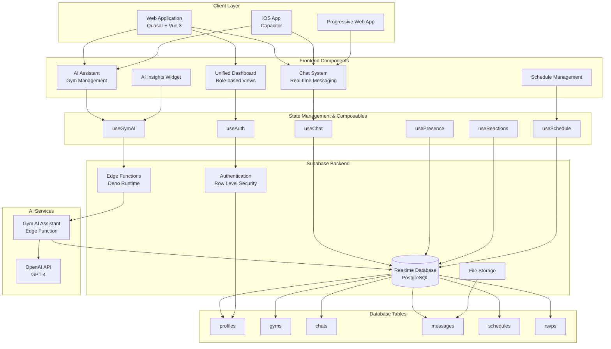
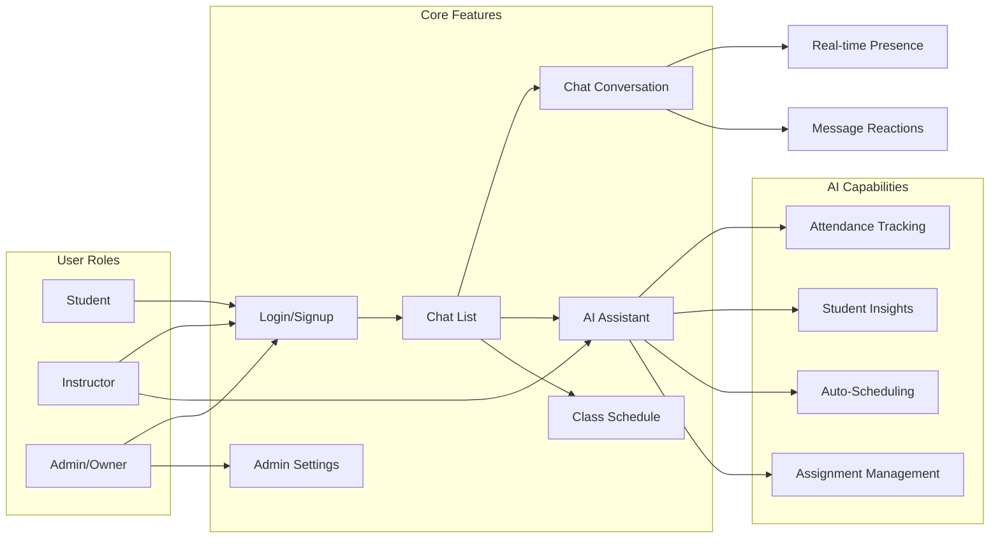
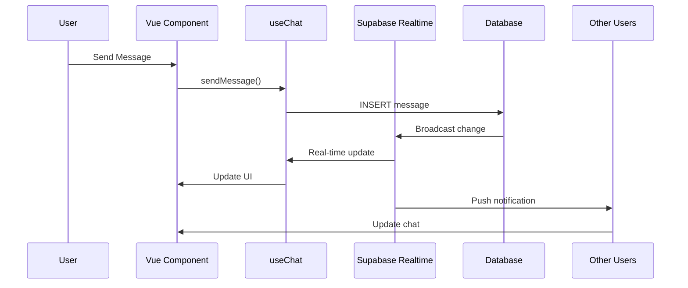
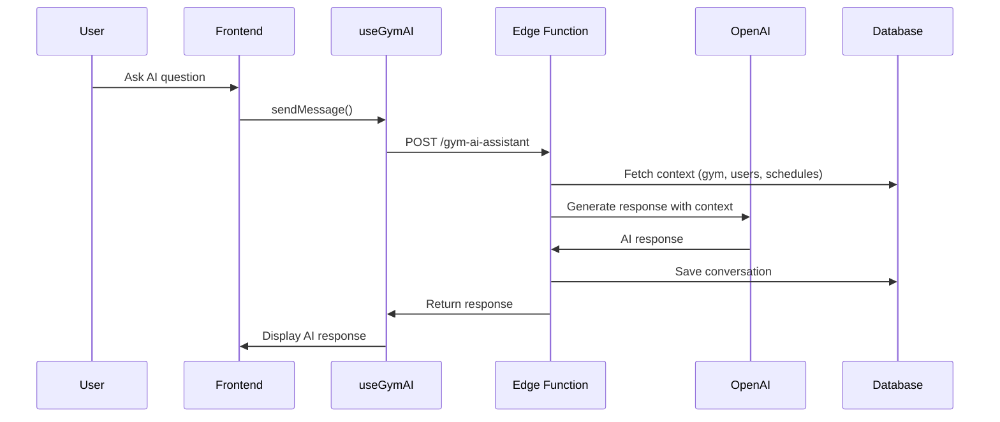
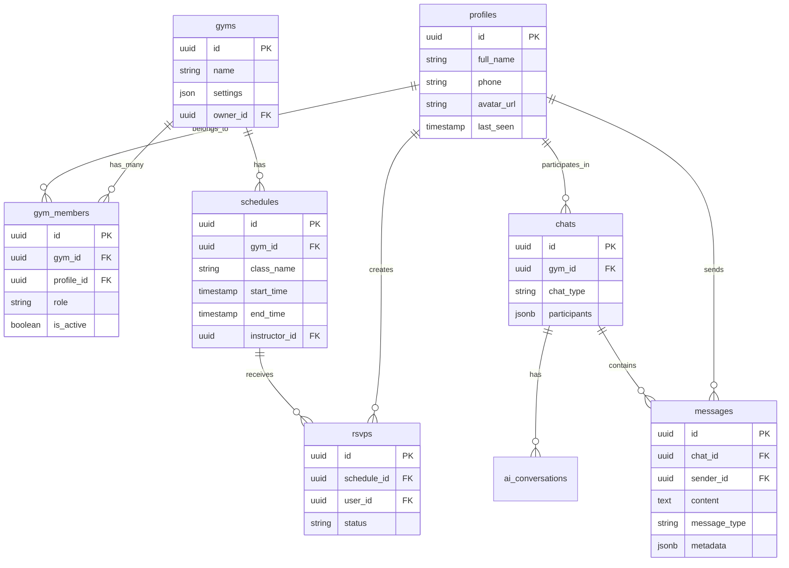
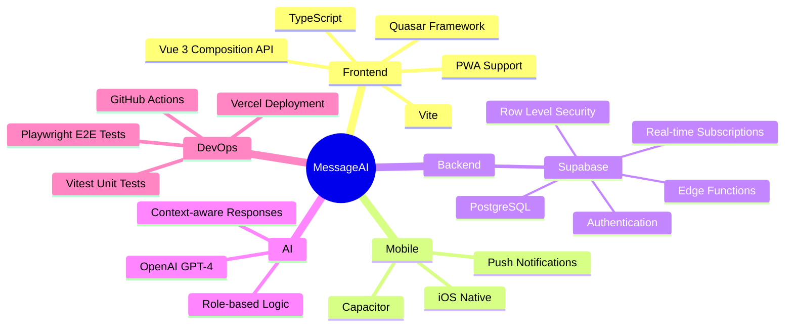
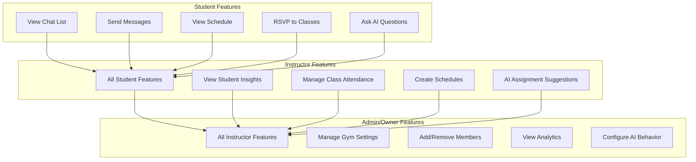
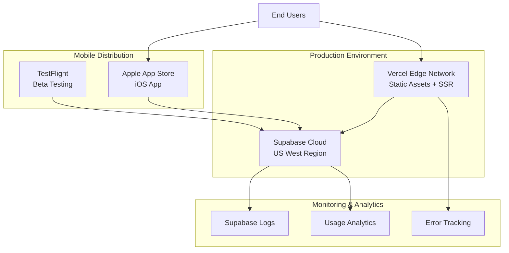

# MessageAI - System Architecture

## High-Level Architecture

## User Flow Diagram

## Data Flow - Messaging

## Data Flow - AI Assistant

## Database Schema Overview

## Technology Stack

## Key Features by Role

## Deployment Architecture

